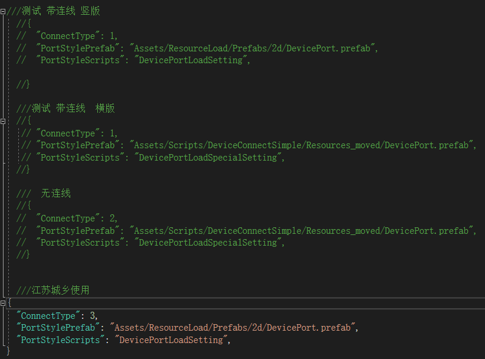

# 设备端子接线

> ## [1.设备端子配置](#1设备端子配置)
> ## [2.接线模式配置](#2接线模式配置)


## 1.设备端子配置

> 填写端子数据参考[配置方法](https://kamisaer.github.io/helloword/Code/Config/#portconfig-ustringu-设备安装配置表)
> -
> 配置好端子表后，[xlsx转json](https://kamisaer.github.io/helloword/Tool/#根据模板生成json文件)
> -
> 生成的设备端子json路径  <u>Assets/LouYuWebgl/Assets/ResourceLoad/Configs/Port</u>
> -

## 2.接线模式配置

> 配置文件路径 <u>Assets/LouYuWebgl/Assets/ResourceLoad/Configs/PortConfig</u>
> -
>json内容参考  
>
 * <u>测试 带连线 竖立</u> 设备端子UI横向排列
 * <u>测试 带连线 竖立</u> 设备端子UI竖向排列
 * <u>无连线 </u> 
 * <u>jscx 使用模式 </u> 

> 类型参数解释

```csharp

# ConnectType 

    public enum ConnectType
    {
        UnDefined,
        Simple2d,    //端子直连  port - port
        SimpleS2dSpecial,  //纯净 
        Rope2d,  //连接一段Rope  port - rope -port
        Simple3d,  //3d连接
    }

# PortStylePrefab 
    端子界面预制体路径

# PortStyleScripts
    端子界面逻辑代码

 ```

 ## 3.设备端子创建逻辑

 ### 流程
 > 1.读取端子配置数据  
 > 2.加载接线模式配置
 > 3.实例化端子界面，并根据配置创建多个端子并赋值


```Markdown

# 单例 业务逻辑掌控者😃
    DeviceConnectPresenter : Singleton<DeviceConnectPresenter>
    用于处理外部数据输入和逻辑分离

# 端子生命周期 全局控制
    DevicePortManager
    所有端子工作开始，和工作中，工作结束状态
 ```
# 设备端子界面代码创建部分
```cs
private void CreateElement2dLine(IEntity entity, Action<IActor> onComplete)
{
    //获取端子配置模式
    var connectMode = DeviceConnectPresenter.Instance.connectMode;  
    //获取端子配置数据
    var data = entity.GetComponent<ECEntity2dLineData>();
    //获取设备通用配置
    var _deviceDic = FW.System.GetSystem<SElementConf>().DeviceToConfJo;
    //端子预制体配置路径
    var path = connectMode.GetPortStylePrefab;
    //异步加载
    FW.Asset.InstantiateAsync(path, go =>
    {
        go.name = $"{entity.type}_{entity.id}";
        var actor = go.GetComp<Actor>();
        actor.InitEntity(entity);
        //设备端子界面演员类 
        actor.AddActorComponent<ACEntity2dLineDrag>();
        //根据设备通用配置名反射绑定端子逻辑脚本
        foreach (var item in _deviceDic[data.Data.deviceId].componentsPort)
        {
            var type = Type.GetType($"{Constant.FWNamespace.MonoComponentNamespace}.{item}");

            if (type != null)
            {
                actor.AddActorComponent(type);
            }
        }
        onComplete?.Invoke(actor);
    }
    );
}

```
# 设备端子界面中各个端子生成代码

## ACEntity2dRopeDrag.cs
## 端子场景

```cs
 private void CreatItem(string setId, LineData lineData,int index )
{
    int curIndex = index;
    GameObject go = Instantiate(element_tpl.gameObject);
    go.transform.FindComp<Text>("txt_portType").text = lineData.Type;
    go.transform.FindComp<Text>("txt_remark").text = lineData.CreateID;
    go.name = lineData.CreateID;
    go.transform.SetParent(element_tpl.transform.parent);
    go.transform.localScale = Vector3.one;
    go.SetActive(true);
    var point = go.transform.Find("point");
    var rope = point.gameObject.AddComponent<RopePort>();
    rope.SetRopePort(setId, lineData);
    var point_event = point.GetComp<UIEventClick>();
    //每个端子的点击事件
    point_event.onClick += mouseEvent =>
    {
       
        connect.connectMode.SetIsMatch(true);
        DeviceConnectPresenter.Instance.OnMouseDown(new DeviceConnectParams { point = rope.transform, data = lineData.CreateID });
        ISaveConnectPortsHandle saveConnect = (ISaveConnectPortsHandle)SaveManager.Instance.GetSaveSystem(nameof(ISaveConnectPortsHandle));
        saveConnect.AddRecordConnectPort(1, actor.entity.id, curIndex, actor.gameObject.transform.position);
        //这里处理匹配类型日志回调打印，项目档期太挤压没时间处理和调试 暂时关闭🤢
        //DeviceConnectPresenter.Instance.OnEPortMatchConsole((console) => {
        //    Debug.LogError(console);
        //    switch (console)
        //    {
        //        case EPortMatchConsole.CorrectMatch:
        //            break;
        //        case EPortMatchConsole.ErrorTypeMatch:
        //            ShowTips("设备端子和线缆类型匹配错误!");
        //            break;
        //        case EPortMatchConsole.ErrorPort:
        //            ShowTips("没有连接线缆!");
        //            break;
        //        case EPortMatchConsole.ErrorRope:
        //            ShowTips("没有连接设备端子!");
        //            break;
        //        case EPortMatchConsole.UnDefined:
        //            ShowTips("未知连接错误!");
        //            break;
        //    }
        //});
    };
}
```

接口定义 IConnectMode

```cs

public interface IConnectMode
{
    //处理鼠标点击端子
    void OnMouseDown(DeviceConnectParams data);
    //处理快捷键
    void OnKeyDown(DeviceConnectParams data);
    //处理事件触发
    void OnTriggerEvent(DeviceConnectParams data);
    //处理端口匹配信息
    void OnEPortMatchConsole(Action<EPortMatchConsole> action);

    //推出
    void QuitMode();

    EPortMatchConsole matchConsole { get; set; }
}

# 匹配类型 🤣 好像做了 好像又没做 估计是为了方便调试逻辑处理被隐藏了

public enum EPortMatchConsole 
{
    //未知错误
    UnDefined,
    ErrorRope,//没有连接线缆
    ErrorPort,//没有连接设备
    ErrorTypeMatch,//线缆和端子类型匹配错误,
    ErrorAttributeMatch,//端子输入输出口匹配错误,
    ErrorFeaturesMatch,//端子特性匹配错误,
    ErrorVoltageMatch,//电压错误,
    CorrectMatch //正确
}

```

# 江苏城乡项目端子逻辑具体实现 Connect2dPortToRope 继承IConnectMode
> 处理了端子的连接逻辑关系
> 简单端子连接表现(贝塞尔曲线 Vectrosity[1](https://kamisaer.github.io/helloword/Tool/#vectrosity))


# 其他端子模式实现 Simple2dConnect 继承IConnectMode
> 端子直连模式，去除端子创建之前各种复杂模块处理
> 相当于端子接线测试单元，在开发中可以使用此模式进行调试，然后调试好后再切换到江苏程序模式
> on ！当前模式又暂弃...由于后期接线需求更改频繁，该模式没有及时更新😢

# 端子接线这块问题还是很多，包括UI表现，操作方法，内部逻辑；
> UI上对于端子过多的设备会占据屏幕太大范围；  
> 操作上多个设备端子之间组网需要处理的隐藏和显示关系逻辑太复杂，程序工作量很大;
>...建议 重新设计，尽量简化用户操作难度


