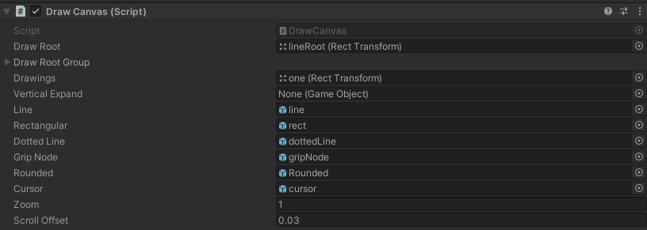

绘图模块
=======


```markdown
#  绘图公开调用单例
DrawLineManager : Singleton<DrawLineManager>
```

# 公开方法

## 实线绘制
```csharp

public void OnDrawLine()
{
    FW.Notice.DispatchNotice(Notices.SetMistouchStatus, false);
    LinesChainCmd cmd = new LinesChainCmd();
    _presenter.OnCommand(cmd as Command);
}

```

## 虚线绘制(效率很低，可以放弃)

```csharp

public void OnDottedLine()
{
    FW.Notice.DispatchNotice(Notices.SetMistouchStatus, false);
    DottedLinesChainCmd cmd = new DottedLinesChainCmd();
    _presenter.OnCommand(cmd as Command);
}

```

## 矩形绘制

```csharp

public void OnDrawRectangular(SingeBridgeSetting setSetting, PipeCrossType pipeCross = PipeCrossType.Init)
{
    FW.Notice.DispatchNotice(Notices.SetMistouchStatus, false);
    RectangularCmd cmd = new RectangularCmd();
    setSetting.RefreshBridgeValue();
    cmd.bridgeSetting = setSetting.singeSetting;
    cmd.createBridge = pipeCross != PipeCrossType.Init;
    cmd.nowPipeCrossType = pipeCross;
    _presenter.OnCommand(cmd);
}

```

## 文字编辑绘制

```csharp

public void OnEditorText()
{
    EditorTextCmd cmd = new EditorTextCmd();
    _presenter.OnCommand(cmd as Command);
}

```

## 引线绘制

```csharp

public void OnCreatleadLine()
{
    leadLineCmd cmd = new leadLineCmd();
    _presenter.OnCommand(cmd as Command);
}

```

## 图例绘制

```csharp

public void OnCreatLegend() {
    CreateLegendCmd cmd = new CreateLegendCmd();
    _presenter.OnCommand(cmd as Command);
}

```

## 撤销
>撤销当前绘制步骤

```csharp

public void OnDrawRollBack()
{
    UndoCmd cmd = new UndoCmd();
    _presenter.OnCommand(cmd as Command);
}

```

## 撤销所有

```csharp

public void OnClearAllUndo()
{
   _presenter.OnClearAllUndo();
}

```

## 取消命令
> 或者说是打断 并不会销毁当前绘制步骤

```csharp

public void OnCancelCmd()
{
   _presenter.OnKeyDown(KeyCode.Space);
}

```

# 通过数据的输入进行绘制

## 数据输入画线

```csharp

public void OnDrawLineInput(LinesChainItem linesChain)
{
    LinesChainCmd cmd = new LinesChainCmd();
    _presenter.OnCommand(cmd as Command);
    _presenter.OnTriggler(linesChain);
}

```

## 数据输入文本框

```csharp

public void OnDrawTextEditInput(EditorTextItem textEditor)
{
    EditorTextCmd cmd = new EditorTextCmd();
    _presenter.OnCommand(cmd as Command);
    _presenter.OnTriggler(textEditor);
}

```

## 数据输入引线

```csharp

public void OnDrawleaderLineInput(leadLineItem leadLine)
{
    leadLineCmd cmd = new leadLineCmd();
    _presenter.OnCommand(cmd as Command);
    _presenter.OnTriggler(leadLine);
}

```

## 数据输入图例绘制

```csharp

public void OnDrawCreatLegendInput(CreateLegendItem createLegend)
{
    CreateLegendCmd cmd = new CreateLegendCmd();
    _presenter.OnCommand(cmd as Command);
    _presenter.OnTriggler(createLegend);
}

```

## 数据输入矩形绘制

```csharp

public void OnDrawRectangularInput(Vector2[] vector2s)
{
    RectangularCmd cmd = new RectangularCmd();
    _presenter.OnCommand(cmd as Command);
    _presenter.OnTriggler(vector2s);
}

```
# 扩展方法

## 鼠标点击坐标记录
```csharp

public void OnMouseButtonDown()
{
    _presenter.OnMouseDown(Input.mousePosition);
}

```

## 额外数据传入

```csharp

public void SetData(object data ) 
{
    _presenter.Set(data);
}

```


# 绘制解释
> public Presenter _presenter;  业务处理者
> _presenter 用于处理Controller模块和数据实体,实体view的关系

## 绘制初始化

> DrawLineManager.Instance.OnInit(DrawCanvas canvas)  //初始化方法
> --------------------------------------------------
> DrawCanvas 继承于 自定义 Canvas 且继承于mono,用于公开对象绑定 ,在切换画布时候进行初始化
> ---------------------------------------------------------------------------------
> DrawCanvas 只需要构建一个 但是里面的参数，需要根据画布的切换进行动态绑定
  * public Transform drawings;  //图纸
  * public Transform drawRoot; //画线父级节点(通常是图纸子级)
> -------------------------------------------
> 初始化时候如果当前画布未存在它持有的_presenter,则new一个并存字典中，下次可直接调用
> ---------------------------------------------------------------------------
> DrawLineManager.Instance.Dispose();  // 退出绘制时候需要主动调用注销，避免其他影响其他模块的绘制，重新进行绘制需要再次进行初始化
>-------------------------------------------------------------------------------------------------------------------------




