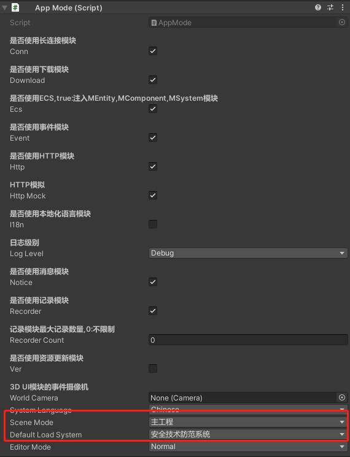

# 程序启动

> ## [1.程序启动](#1程序启动)
> ## [2.配置表加载和读取]
> ## [3.设备资源库]
> ## [3.设备资源库创建]
> ## [4.绘图模块]
> ## [5.线缆绘制]
> ## [6.设备仿真]
> ## [7.设备端子接线]
> ## [8.保存系统]
> ## [9.新手引导]

## 1.程序启动

### 启动场景路径
> Assets/App.unity
> 启动脚本AppMode



### 选择场景模式
> 主工程 字面意思
> 设备认知 单独打开设备资源库UI，点击Item后展示设备的模型，设备参数描述，拆解等
> 接线预览 用于设备接线单独测试，后期更新改动多大暂时放弃
```csharp
public enum SceneMode
{
    主工程 = 0,
    设备认知,
    接线预览
}
```
### 选择设备系统
> 只有在场景模式选择设备认知才生效
> 根据选择类型对加载的设备资源库进行筛选，只会加载选择类型设备
```csharp
public enum DeviceSystemType
{
    全部 = 0,
    安全技术防范系统 = 1,
    消防自动化系统 = 3,
    综合布线系统 = 4,
    IBMS系统 = 5,
    会议系统 = 6,
    广播系统 = 7,
    LED显示系统 = 8,
    信息发布系统 = 9,
    网络电视系统 = 10,
    供配电系统 = 11,
    机房工程 = 12,
    周界安防系统 = 13,
    楼宇自控系统 = 14,
    其他 = 99
}
```

### 开始运行
> 从Application.streamingAssetsPath中获取服务器url并保存
> WebGLUtil.baseUrl作为后续和后台请求url
> WebGLUtil.loginUrl用于编辑模式下进行本地账号登陆，方便开发测试
```csharp
IEnumerator ParseBackUrl() {
    UnityWebRequest request = UnityWebRequest.Get($"{Application.streamingAssetsPath}/url.json");
    yield return request.SendWebRequest();
    string str = request.downloadHandler.text;
    var content = JsonConvert.DeserializeObject<JObject>(str);
    WebGLUtil.baseUrl = content["baseUrl"].ToString();
    WebGLUtil.loginUrl = content["loginUrl"].ToString();
    Debug.Log($"请求地址  {WebGLUtil.baseUrl.ToString()}");
    Debug.Log($"测试登录地址  {WebGLUtil.loginUrl.ToString()}");
    OnStart();
}
```
### 截取前端url地址参数
> webgl版本 web前端通过url地址后缀添加参数返回到unity
> 解析方法 [WebGLUtil.instance.ParseUrlMsg("params string[] args)](http://ddd)
```csharp
public void OnStart() {
    WebGLUtil.instance.ParseUrlMsg(params string[] args);
    Global.defaultSystemIndex = ((int)defaultLoadSystem).ToString();
    string getParamsSceneMode = WebGLUtil.instance.GetParamsDic("SceneMode");
    string toInt = string.IsNullOrEmpty(getParamsSceneMode) ? ((int)sceneMode).ToString() :getParamsSceneMode;
    SceneMode nowMode = (SceneMode)int.Parse(toInt);
    ConText conText = new ConText(nowMode);
    conText.Launch();
    MainProcess.Instance.OnInitialize();
}
```
