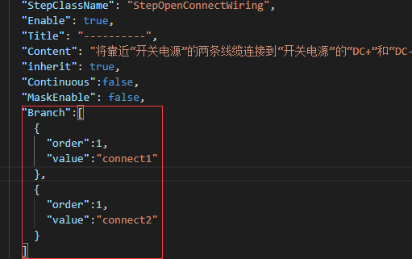

# 新手引导篇

> ## [1.引导配置](#1引导配置)
> ## [2.编辑器创建引导步骤脚本](#2编辑器创建引导步骤脚本)  
> ## [3.引导步骤执行管理](#3引导步骤执行管理)


## 1.引导配置


### GuideData .json:
> 路径  <u>Assets/StreamingAssets/GuideData.json</u>
> 几个重要字段解释
> 字段: "Produce" 引导流程控制模块的脚本名称（程序填写，反射加载脚本，共8个模块，可以任意切换引导流程模块）  
> 字段： "StepClassName" 每个步骤的脚本名称(程序填写，反射加载，步骤在流程控制模块中)
> 其他由需求进行填写，基本都是通俗词汇 这里不解释
> 

## 2.编辑器创建引导步骤脚本

### [MenuItem("CubeSpace/GuideScriptsGenarator/ 创建新手引导步骤(已经存在的不做处理)")]
> 编辑器方法调用
> 根据步骤脚本模板创建新的脚本，如果文件已存在则不处理

这里展示一个自动创建的步骤脚本，包含了整个步骤的从开始执行到完成整个周期

```cs

namespace TLF.Guide
{
/// <summary>
/// 在菜单栏中选择【工程流程】下拉菜单，选择【施工组织设计】，或者使用快捷键【Shift+2】快速进入施工组织设计流程
///自动生成于：2021/12/8 14:03:03
/// </summary>
public class StepConstructiSonDesign : StepContent
{
    protected bool isdone = false;
    public override void Execute()
    {
        base.Execute();
        FW.Event.BindEvent(GuideBlindEventName.LS_2, () => Input.GetKey(KeyCode.LeftShift) && Input.GetKey(KeyCode.Alpha2), () => { isdone = true; });
    }
    public override void Update()
    {
        base.Update();
    }
    public override void Complete()
    {
        base.Complete();
        FW.Event.UnbindEvent(GuideBlindEventName.LS_2);
        isdone = false;
    }
    public override bool IsDone()
    {
        return isdone;
    }
}
}

```

## 3.引导步骤执行管理 
> 管理器 StepManager
> 处理过程:
1. 读取配置
2. 反射加载步骤脚本，并存进List
3. update 处理步骤切换逻辑，顺序取出步骤，如果步骤完成结束设置IsDone，在取出下一步骤
4. 当前引导流程模块所有步骤完成结束，则调用切换下一个引导流程模块，调用步骤
5. 步骤过程中可以暂停或者跳过

###步骤执行事件

```cs
/// <summary>
/// 步骤开始事件
/// </summary>
public event StepEvent StepBeginEvent;
/// <summary>
/// 步骤结束事件
/// </summary>
public event StepEvent StepEndEvent;
/// <summary>
/// 步骤执行事件
/// </summary>
public event StepEvent StepExecuteEvent;
/// <summary>
/// 步骤执行过程事件
/// </summary>
public event StepEvent StepUpdateEvent;
/// <summary>
/// 步骤完成事件
/// </summary>
public event StepEvent StepCompleteEvent;
/// <summary>
/// 步骤暂停事件
/// </summary>
public event StepEvent StepPauseEvent;
/// <summary>
/// 步骤跳过事件
/// </summary>
public event StepEvent StepSkipEvent;

```

### 步骤完成结束判断

除了提到的 在当前步骤脚本中根据具体逻辑设置isDone

补充一个新的步骤完成判断,我取名为分支判断，主要是在需求中出现了同一个引导步骤中，需要做多个步骤操作（😒为啥不拆开，哪来那么多事）
> 所以需要在同一个步骤中加多个分支步骤进行判断，全部完成才算通过
> 在执行当作的代码中调用   FW.Get<StepManager>().CompleteBranch("value");
>   
> order 为多分支判断顺序，如果都是1则无序，
> value 为CompleteBranch的传参

