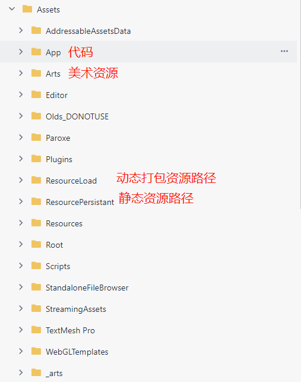

# 通用篇

## 1.准备

- unity开发版本 [Unity2019.4.11f1](https://unity.cn/releases/full/2019)
- 下载安装 当前Unity版本WebGL环境部署包
- 发布运行环境Window WebGl
- WebGL环境支持浏览器Chromn Firefox
  

## 2.coding相关

- 项目coding地址 [url](https://e.coding.net/icubespace/jiangsuchengxiang/JSCX.git)
- 项目相关需求文档地址 [url](https://icubespace.coding.net/p/jiangsuchengxiang/wiki/447)
- develop 为最新分支
  
## 3.项目文件夹路径解释

------------------------------------------------------------------------------------------

### 部分路径解释

1. Assets/StreamingAssets/url.json 
   - 存放请求服务器数据url 放于此处便于修改
  
2. Assets/StreamingAssets/GuideData.json
   - 新手引导数据配置修改

3. Assets/ResourceLoad
   - 动态加载资源存放路径  该路径下资源将被打包（需要手动设置地址）

4. Assets/WebGLTemplates
   - 发布成WebGL网页主题模板 目前使用目标为Assets/WebGLTemplates/TriLib
   - 替换网页加载Logo
     - 将Assets/WebGLTemplates/TriLib 下logo.png替换(如果运行没有变化,清除浏览器缓存)