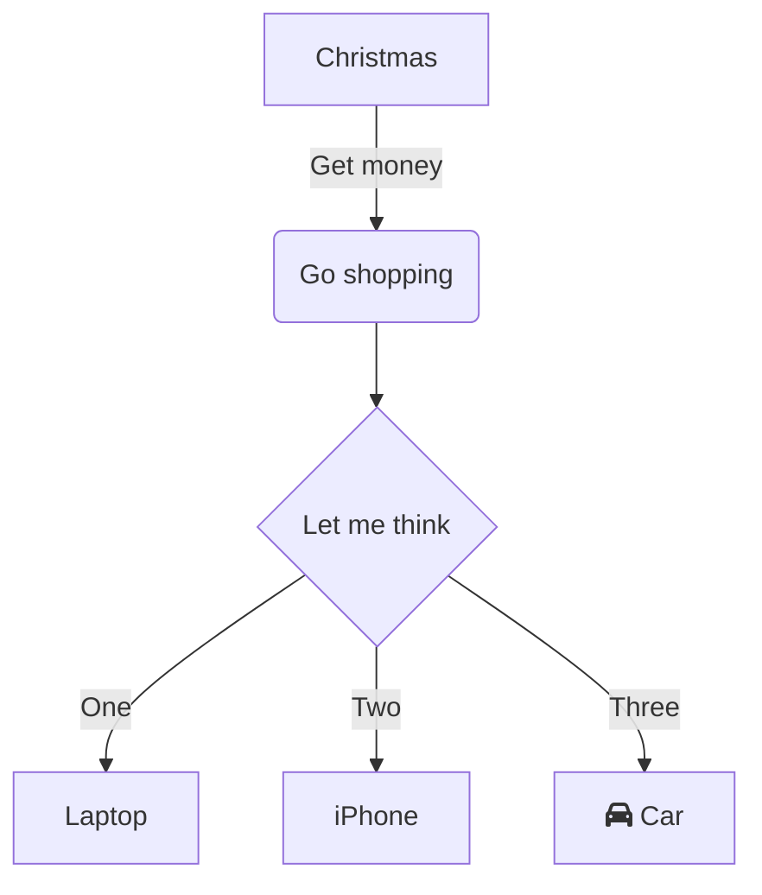

# Welcome 

[!https://mermaid-js.github.io/mermaid/#/n00b-syntaxReference?id=syntax-structure]

```mermaid
  graph TD;
      A-->B;
      A-->C;
      B-->D;
      C-->D;

      
```

```mermaid
graph TD
    A[Christmas] -->|Get money| B(Go shopping)
    B --> C{Let me think}
    C -->|One| D[Laptop]
    C -->|Two| E[iPhone]
    C -->|Three| F[fa:fa-car Car]

      
```