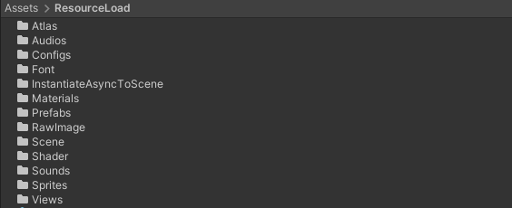

# 资源篇
> ## [1.资源路径](#1资源路径)
> ## [2.资源优化](#1资源优化)
> ## [3.资源索引](#3资源索引)
> ## [4.资源标准](#4资源索引)
> ## [4.渲染参数](#5资源索引)

## 1.资源路径
动态加载资源:

主要关注路径:
> Views:所有UI存放路径
> Atlas:图集文件，添加到图集的sprite就不需要放到ResourceLoad,防止重复打包

## 1.资源优化

基于webgl平台，由于项目美术资源很大，所以尽可能的压缩资源

### 贴图压缩

1. 删除模型的法线贴图，那一点点的效果根本不明显，白占内存
2. 2的N次方大小的图片会得到引擎更大的支持，包括压缩比率，内存消耗，打包压缩大小，而且支持的力度非常大（但是给到的图好像并不都是这样，这块没有认真去审核,我的锅）
3. 修改部分Texture的压缩格式占位
4. 修改Texture分辨率,模型基本是1024x1024，ui512x512及一下

### 资源打包

Addressables 打包时候注意将资源尽量拆成多个包，太大的包在第一次加载时候会很慢，而且容易引起网页崩溃

## 3.资源索引

### 给每个设备模型添加一个唯一id，同时可以索引到相关的Sprite，配置文件等

