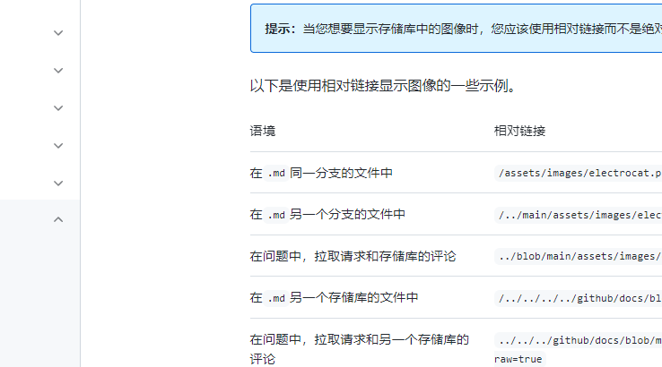

## Welcome to GitHub Pages

//=======================链接===================================================================//
[TEST Pages](https://kamisaer.github.io/helloword/Test/)


//=======================代码块===================================================================//
```markdown
Syntax highlighted code block

# Header 122gdfg 
## Header 2
### Header 3

- **Bulleted**
- List

1. Numbered  '法沙发沙发' Asdgsdaf
2. List

**Bold** and _Italic_ and `Code` text
```




- aaa
- bbbb
- ccc

1. AAA
   - aaa
     - bbb 

@octocat :+1: This PR looks great - it's ready to merge! :shipit:


| First Header  | Second Header |
| ------------- | ------------- |
| Content Cell  | Content Cell  |
| Content Cell  | Content Cell  |

| Command | Description |
| --- | --- |
| git status | List all new or modified files |
| git diff | Show file differences that haven't been staged |


