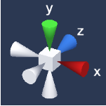

# 工具篇
> ### [1.插件](#1插件)
> ### [2.内部工具](#1插件)

## 1.插件

> ### [1. EHFW0.3.0](#EHFW0.3.0)
> ### [2. Newtonsoft.Json.12.0.1](#newtonsoftjson1201)
> ### [3. Demigiant](#demigiant)
> ### [4. HighlightPlus](#highlightplus)
> ### [5. Vectrosity](#vectrosity)
> ### [6. Minikits](#minikits)
> ### [7. AVProVideo](#avprovideo)
> ### [8. NatCorder](#natcorder)
> ### [9. Paroxe](#paroxe)
> ### [10. RuntimeSceneGizmo](#runtimescenegizmo)
> ### [11. VolumetricLightBeam](#volumetriclightbeam)


======================================================================================


### EHFW0.3.0

> 公司内部框架 集成了一些常用方法
> 需要同时导入 **Newtonsoft.Json.12.0.1** 和 **Demigiant** 插件
> 安装 **Addressables** 寻址

```csharp
> 部分调用举例
  - 加载UI并显示 
    - FW.UI.Load<XXXUI>().Show();
  - 加载资源 
    - FW.Asset.Load<GameObject>("Assets/a.prefab",(e)=> { });
  
```
 [接口调用示例](FW.cs)


### Newtonsoft.Json.12.0.1
> json序列化和反序列化

```csharp
                try
                {
                    list = JsonConvert.DeserializeObject<List<GroupData>>(text.text);

                }
                catch (Exception e)
                {
                    FW.Log.Error($"Deserialize To List<GroupData> Error, Msg :{e.Message}");
                    return;
                }
```

### Demigiant
> 动画插件 用于摄像机的位移等移动 旋转等动作

### HighlightPlus
> 3D物体高亮


### Vectrosity
> 用于设备接线模块 2d接线
> 贝塞尔曲线

### Minikits
> 轻量型3D具有物理属性的绳索 [商店地址](https://assetstore.unity.com/packages/tools/physics/rope-minikit-154662)
> unity Project Setting Api等级需要设置.NET 4.X
> Package安装Burst

### AVProVideo
>视频播放

### NatCorder
>运行时录屏

### Paroxe
> PDF

### RuntimeSceneGizmo
>运行时UI小组件，单击b不同轴向可触发事件


### VolumetricLightBeam
>体积光
>用于模拟灯光照射

## 1.内部工具

> ### [1. excel2json](#excel2json)
> ### [2. Newtonsoft.Json.12.0.1](#newtonsoftjson1201)
> ### [3. Demigiant](#demigiant)
> ### [4. HighlightPlus](#highlightplus)
> ### [5. Vectrosity](#highlightplus)
> ### [6. Minikits](#highlightplus)
> ### [7. AVProVideo](#highlightplus)
> ### [8. NatCorder](#highlightplus)
> ### [9. Paroxe](#highlightplus)
> ### [10. RuntimeSceneGizmo](#highlightplus)
> ### [11. VolumetricLightBeam](#highlightplus)


### excel2json
```
```