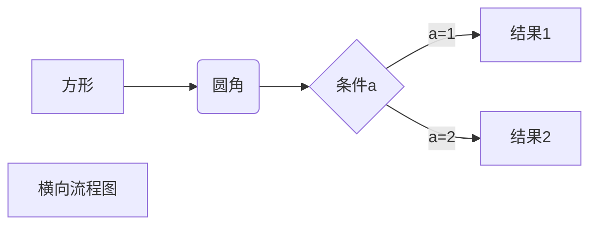

# Welcome 
[TEST Pages](https://kamisaer.github.io/helloword/Test/)

## 1. [通用篇](https://kamisaer.github.io/helloword/Common/)  
## 2. [工具篇](https://kamisaer.github.io/helloword/Tool/)  
## 3. [程序篇](https://kamisaer.github.io/helloword/Code/)  
## 4. [资源篇](https://kamisaer.github.io/helloword/Resource/)  
## 5. [项目篇](https://kamisaer.github.io/helloword/Project/) 

